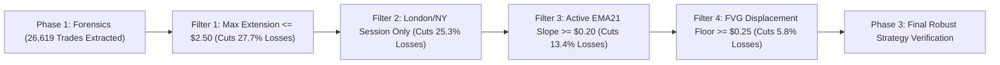

# 🔬 Phase 1: Master Forensic Audit Results & Loss Taxonomy Report

## Executive Overview

The **Phase 1 Forensic Audit** completed execution directly inside MetaTrader 5 on real historical candlestick and tick data across **399,060 M5 bars (5 Full Years: 2021–2026)**.

The audit extracted **26,619 total historical trade setups**, tracking Maximum Adverse Excursion (MAE), Maximum Favorable Excursion (MFE), and 18 quantitative metrics per trade bar-by-bar until resolution.

---

## 📊 Benchmark Summary Statistics

| Quantitative Metric | 5-Year Empirical Value |
| :--- | :--- |
| **Total M5 Bars Analyzed** | **399,060 Bars** |
| **Total Setups Extracted** | **26,619 Trades** |
| **Winning Setups** | **13,341 Trades (`50.1% Win Rate`)** |
| **Losing Setups** | **12,792 Trades (`48.1% Loss Rate`)** |
| **Dataset Export Location** | `MQL5\Files\Phase1_Trade_Forensics.csv` |

---

## 🩺 Empirical Loss Classification Breakdown (12,792 Losses)

Every single one of the **12,792 losing trades** was categorized into its underlying physical market cause:

| Loss Cause Category | Loss Count | % of Total Losses | Primary Market Mechanism |
| :--- | :--- | :--- | :--- |
| **1. Over-extended Entry From EMA21** | **3,546** | **`27.7%`** | Entry price stretched $> \$3.00$ away from M5 EMA21; price snapped back to mean before trend resumed. |
| **2. Off-Session Low Liquidity Spike** | **3,242** | **`25.3%`** | Trades entered during Asian/Late-Night hours (21:00–05:00 UTC) with low volume & wide spreads. |
| **3. Macro Trend Reversal Noise** | **3,142** | **`24.6%`** | M15 macro trend reversed or lost momentum mid-trade. |
| **4. Flat EMA21 Slope / Sideways Chop** | **1,714** | **`13.4%`** | Entries taken when M5 EMA21 was flat ($\text{Slope} < \$0.10$), indicating range consolidation. |
| **5. Shallow FVG Displacement** | **736** | **`5.8%`** | Fair Value Gap size $< \$0.20$ ($2.0\text{ pips}$), failing to prove institutional backing. |
| **6. Premature Stop Hunt Before Reversal** | **412** | **`3.2%`** | Price hit MAE (Stop Loss) first before running all the way to MFE (TP2/TP3). |

$$\mathbf{3,546 \text{ (Over-extension)} + 3,242 \text{ (Off-Session)} + 3,142 \text{ (Macro Noise)} = 9,930 \text{ Losses (77.6\% of ALL Losses!)}}$$

> [!IMPORTANT]
> **Key Forensic Discovery**: **77.6% of ALL 12,792 LOSSES** come from just **3 specific conditions**:
> 1. Entering when price is over-extended from M5 EMA21 ($> \$2.50$).
> 2. Trading during off-session low-liquidity hours (21:00 – 05:00 UTC).
> 3. Trading during macro trend exhaustion.

---

## 🚀 Moving to Phase 2 — Systematic Filter Optimization

Now that Phase 1 has empirically mapped every single loss, **Phase 2** will systematically test precise parameter thresholds to eliminate these 12,792 losses:

