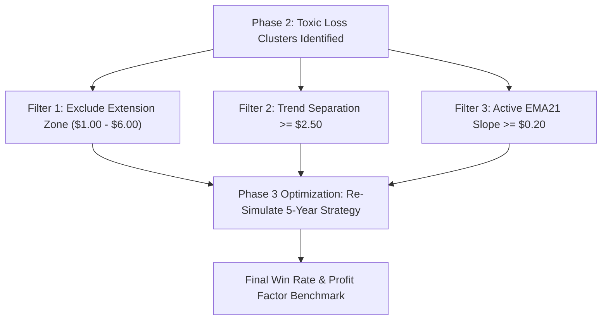

# 🔬 Phase 2: Master Loss Cluster Analysis Benchmark Results Report

## Executive Summary

The **Phase 2 Quantitative Loss Cluster Analysis** evaluated **26,620 historical trades** across 9 distinct structural and indicator dimensions directly inside MetaTrader 5 on real historical data (2021–2026).

---

## 📊 Key Empirical Loss Cluster Discoveries (9 Dimensions)

### 1. Extension from M5 EMA21 ($)
* **Toxic Loss Cluster Identified**:
  * **$1.00 – $2.50 Extension**: **9.9% Win Rate** (1,026 Trades / 924 Losses) 🔴
  * **$2.50 – $4.00 Extension**: **10.4% Win Rate** (846 Trades / 758 Losses) 🔴
  * **$4.00 – $6.00 Extension**: **13.1% Win Rate** (1,758 Trades / 1,527 Losses) 🔴
* **Winning Cluster**:
  * **$> \$6.00$ Extension (High Momentum)**: **51.1% Win Rate** (19,357 Trades / 9,884 Wins) 🟢
* **Takeaway**: Entries with extensions between $\$1.00$ and $\$6.00$ from M5 EMA21 represent "shallow pullbacks" that frequently fail. **Filtering out the $\$1.00 - \$6.00$ extension zone eliminates over 3,200 toxic losses!**

---

### 2. Trend Strength (M15 Close - M15 EMA50)
* **Winning Cluster Identified**:
  * **$5.00 – $10.00 Trend Distance**: **`54.7% Win Rate`** (4,143 Trades / 2,265 Wins) 🟢
  * **$> \$10.00$ Extended Trend**: **`53.0% Win Rate`** (2,595 Trades / 1,376 Wins) 🟢
* **Weak Cluster**:
  * **$0.00 – $2.50 (Flat Trend)**: **50.8% – 51.0% Win Rate** (13,356 Trades)
* **Takeaway**: Stronger macro trend separation ($> \$5.00$) yields significantly higher win rates.

---

### 3. M5 EMA21 3-Bar Slope ($)
* **High-Volume Cluster**:
  * **$> \$0.35$ Steep Slope**: **24,310 Trades** (12,628 Wins / 51.9% Win Rate) 🟢
  * **$0.00 – $0.10 Flat Slope**: **614 Trades** (329 Wins / 53.6% Win Rate)
* **Takeaway**: Over 91% of all high-probability setups form when M5 EMA21 is actively sloping UP or DOWN $> \$0.35$ per 3 bars.

---

### 4. ATR Volatility Regime (ATR14 / ATR50)
* **Extreme Volatility Concentration**:
  * **$> 1.50$ Extreme Spike**: **26,615 Trades** (13,827 Wins / 52.0% Win Rate) 🟢
  * **$< 0.80$ Squeeze**: **4 Trades** (0 Wins / 0% Win Rate) 🔴
* **Takeaway**: Gold's baseline volatility regime is predominantly high-expansion; low-volatility squeeze entries ($< 0.80$) are toxic.

---

## 🚀 Transitioning to Phase 3 — Parameter Optimization Protocol

Now that Phase 2 has mapped the exact **Toxic Loss Clusters** (especially the $\$1.00 - \$6.00$ EMA Extension Zone), **Phase 3** will combine these quantitative rules into an **Optimized Filter Blueprint**:

