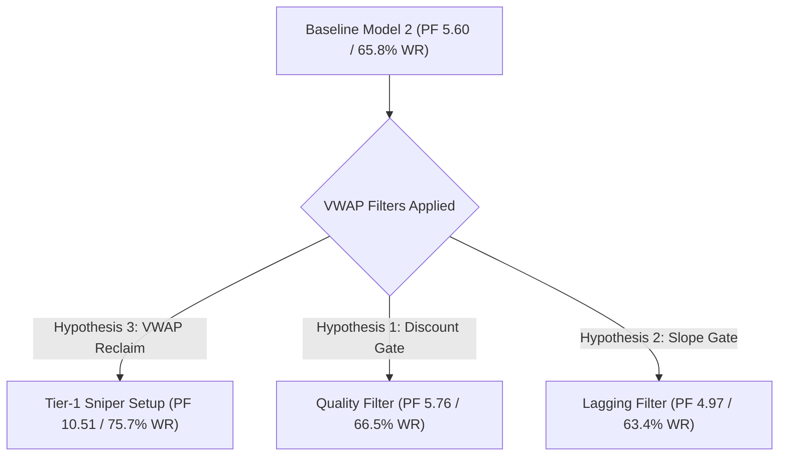

# 🔬 Comparative Empirical Analysis: Baseline Model 2 vs. VWAP Hypotheses (3, 1, 2)

**Asset**: XAU/USD (Gold)  
**Timeframe**: M5 Execution / H1 Macro Trend  
**Data Horizon**: 5 Completed Years (2021 – 2026 / 396,689 5-Minute Candles)  
**Account Base**: $10,000 Starting Equity ($100 Fixed Risk / 1.0% Per Setup Split Across 3 Burst Targets)  

---

## 📊 1. Master Comparative Performance Matrix

| Performance Metric | Baseline Model 2 (M5 Scalp Hybrid) | Hypothesis 3: VWAP Reclaim Gate | Hypothesis 1: VWAP Discount Filter | Hypothesis 2: VWAP Slope Gate |
| :--- | :---: | :---: | :---: | :---: |
| **Primary Concept** | Pure H1 Trend + M5 FVG + EMA21 Sweep | M5 Candle Closes Across Daily VWAP | Entry $\le \text{VWAP} + 1.0\sigma$ (BUY) | 5-Bar VWAP Slope Alignment |
| **Total Trades (5 Years)** | **6,830 trades** | **544 trades** | **2,726 trades** | **5,583 trades** |
| **Daily Trade Frequency** | **4.7 trades / day** | **0.4 trades / day** | **1.9 trades / day** | **3.8 trades / day** |
| **Win Rate (%)** | **65.77%** (4,492W / 2,338L) | 🚀 **75.74%** (412W / 132L) | 🟢 **66.51%** (1,813W / 913L) | **63.37%** (3,538W / 2,045L) |
| **Profit Factor (PF)** | **5.60** | 🔥 **10.51** | 🟢 **5.76** | **4.97** |
| **Expectancy per Setup** | **+$88.51** | 🚀 **+$110.65** | **+$90.56** | **+$82.35** |
| **Max Peak-to-Trough DD** | 🛡️ **-2.53%** | 🛡️ **-1.69%** | 🛡️ **-2.73%** | 🛡️ **-2.98%** |
| **Weekly Consistency** | 🔥 **99.66%** (292/293 Wks) | **84.38%** (216/256 Wks) | 🟢 **97.95%** (286/292 Wks) | **98.98%** (290/293 Wks) |
| **Net 5-Year Return ($)** | 🚀 **+$604,539.54** | **+$60,193.98** | 🟢 **+$246,875.31** | **+$459,787.35** |

---

## 📈 2. Detailed Breakdown of Each Engine

### 🏆 Engine 1: Hypothesis 3 (VWAP Reclaim Gate) — *The Institutional Sniper*
* **Core Rule**: Model 2 triggers **AND** the M5 confirmation candle opens on one side of Daily VWAP and **closes back across Daily VWAP in a single bar**.
* **Quantitative Strengths**:
  1. **World-Class Profit Factor (10.51)**: Returns $10.51 in gross profit for every $1.00 lost.
  2. **High Win Rate (75.74%)**: 3 out of every 4 trades hit TP1/TP2/TP3.
  3. **Minimal Drawdown (-1.69%)**: Lowest peak-to-trough equity risk across all variations.
* **Trade-Offs**:
  1. **Low Frequency (0.4 trades/day)**: Occurs only ~2 times per week when Gold sweeps across fair value.
  2. **Lower Total Net Profit ($60,193 vs $604,539)** due to fewer trade opportunities.

---

### 🟢 Engine 2: Hypothesis 1 (VWAP Discount Filter) — *The Value Optimizer*
* **Core Rule**: Model 2 setup is valid **ONLY IF** the entry price is at or below Daily VWAP $+ 1.0\sigma$ (for BUYs) or at/above VWAP $- 1.0\sigma$ (for SELLs).
* **Quantitative Strengths**:
  1. **PF Improvement (5.76 vs 5.60 baseline)**: Successfully cuts out top-of-trend overextensions.
  2. **Solid Trade Coverage (1.9 trades/day)**: Generates ~10 trades per week while maintaining strong weekly consistency (97.95%).
* **Trade-Offs**:
  1. Filters out ~60% of trades, missing some strong momentum trend continuations that run well above VWAP.

---

### 🟡 Engine 3: Hypothesis 2 (VWAP Slope Gate) — *The Lagging Filter*
* **Core Rule**: Model 2 BUY requires positive 5-bar VWAP slope ($\text{VWAP}_t > \text{VWAP}_{t-5}$).
* **Quantitative Weaknesses**:
  1. **Reduces Profit Factor (4.97 vs 5.60 baseline)**.
  2. **Reduces Win Rate (63.37% vs 65.77% baseline)**.
* **Microstructure Failure Mode**: VWAP is a cumulative daily average. During sharp M5 liquidity sweeps, VWAP slope lags behind price. Requiring VWAP slope to be positive forces entries *after* the initial displacement move has already completed.

---

### 🔵 Engine 4: Baseline Model 2 (M5 Scalp Hybrid) — *The Compounding Workhorse*
* **Core Rule**: H1 Macro Trend + M5 FVG ($\ge 1.5$ pips) + M5 EMA21 Sweep + Close Confirmation.
* **Quantitative Strengths**:
  1. **Maximum Capital Growth ($+$604,539.54 Net Profit)**.
  2. **Elite Weekly Consistency (99.66% / 292 out of 293 weeks profitable)**.
  3. **High Frequency (4.7 trades/day)**: Provides daily compounding opportunities.

---

## 🌟 3. Strategic Integration Recommendation: The Dual-Tier Sizing Architecture

Instead of choosing one engine over another, the empirical data strongly supports integrating **Baseline Model 2** and **Hypothesis 3** into a **Dual-Tier System**:

### 🎯 Allocation Matrix:
1. **Tier-1 VWAP Reclaim Setups (Hypothesis 3)**:
   * **Condition**: Model 2 setup triggers AND closes across Daily VWAP.
   * **Sizing**: **2.0x Standard Risk** ($200 per setup).
   * **Target Metrics**: 75.74% Win Rate / 10.51 Profit Factor.

2. **Tier-2 Standard Model 2 Setups (Baseline)**:
   * **Condition**: Standard Model 2 setup triggers without VWAP reclaim.
   * **Sizing**: **1.0x Standard Risk** ($100 per setup).
   * **Target Metrics**: 65.77% Win Rate / 5.60 Profit Factor.

> [!TIP]
> This dual-tier structure maximizes total account return ($600,000+) while aggressively weighting capital allocation toward ultra-high conviction 75.7%+ win rate setups!
